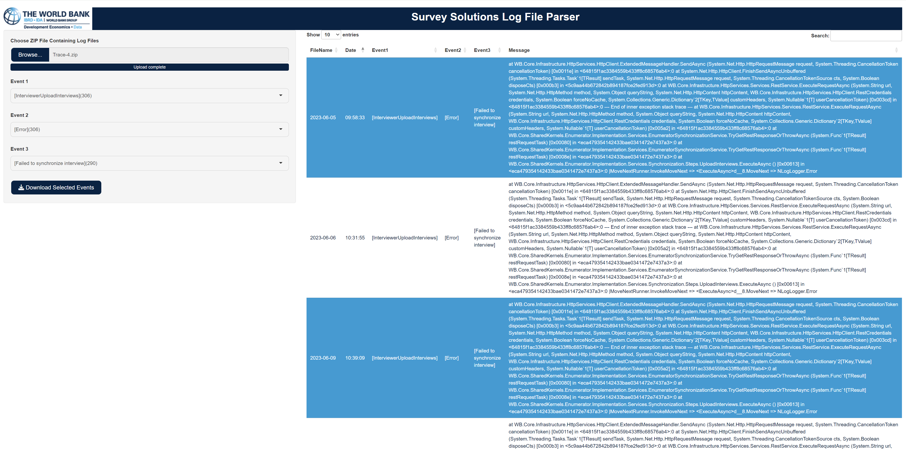

<!-- README.md is generated from README.Rmd. Please edit that file -->

<a href='https://docs.mysurvey.solutions/'></a>

# Survey Solutions System Log Parser

<!-- badges: start -->

[](https://lifecycle.r-lib.org/articles/stages.html#experimental)
<!-- badges: end -->

<div align="justify">

This application is part of the large set of tools, to facilitate survey
implementation with [Survey
Solutions](https://docs.mysurvey.solutions/). It allows to parse system
log files, as requested for debugging cases by the Survey Solutions
support, review them in a table, and finally download relevant events to
be forwarded to the support team when requested or used internally for
further processing.

<center>

</center>

## Installation

- Install R: <https://cran.r-project.org/mirrors.html> (version 4.1.1 or
  greater)

- Install R Studio: <https://rstudio.com/products/rstudio/download/>
  (version 1.2.5001-3 or newer)

- Make sure the *devtools* package is installed, if not install it with:

``` r
install.packages("devtools")
```

- After that install the actual package:

``` r
devtools::install_github("michael-cw/susologparser")
```

## Start the application from RStudio

``` r
library(susologparser)
susologparser::runLogParser()
```

## Start the application on a Shiny Server

In case you are considering to run the application on a shiny server,
you just need to create the following app.R script in your shiny server
app directory:

``` r
library(susologparser)
susologparser::runLogParserServer()
```

</div>
